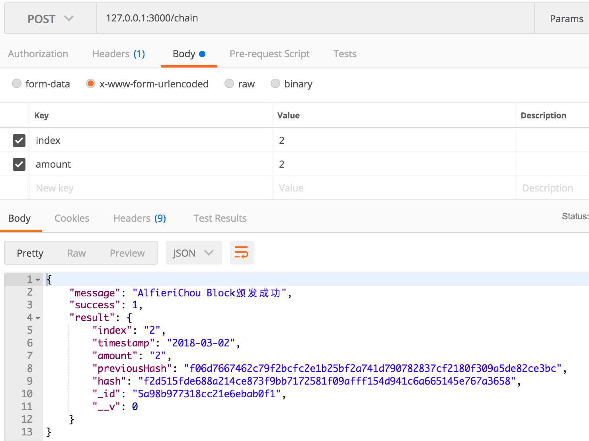
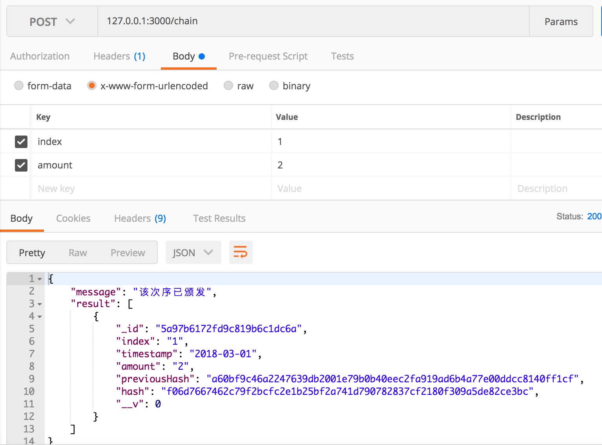
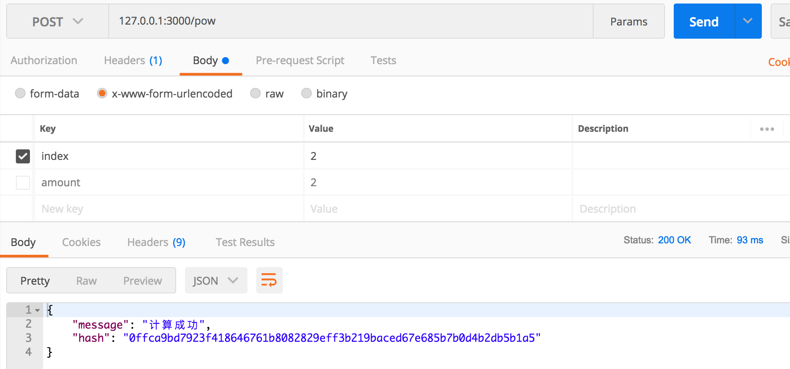
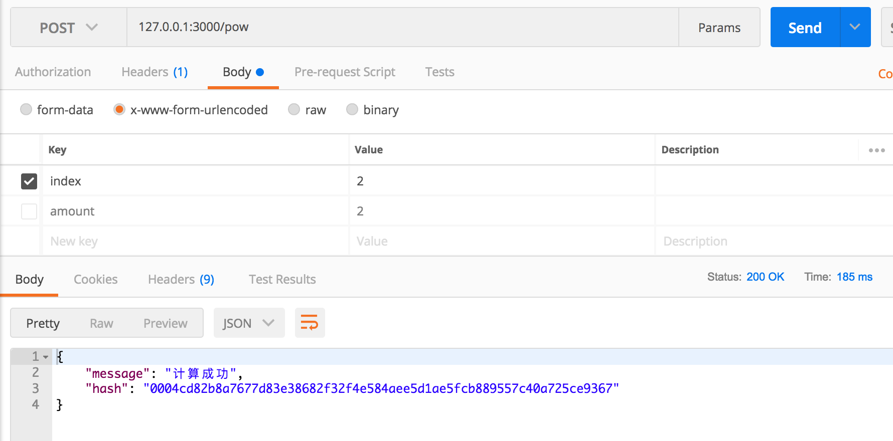
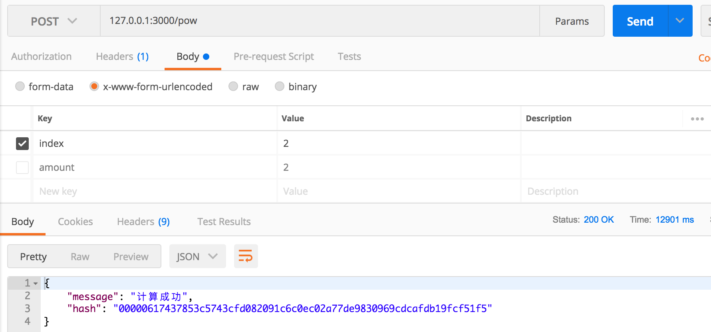

# NodeBlockChain
BlockChain

### 前言

* 研究了一个多星期的block chain，终于有点收获了。也算有点小成吧。
* 这个pow算法整的比摸奖还爽。事实证明，学好概率论还是相当有必要的。

### 生成chain

1. 发布chain
  
  
2. 已发布的chain
  
  
* chain的上一次颁发的hash是下一次的previousHash。通过这样的方式连接起来，就形成了整条区块链。

### pow算力难度测试

1. 算力难度为1的时候，生成hash大概需要93ms
  
  
2. 算力难度为3的时候，生成hash大概需要185ms
  
  
3. 算力难度为5的时候，生成hash大概需要12901ms
  
  
### 后记

* 区块链真的是个烧脑壳的东西，摸一摸头好像又掉了一把头发。
* pow是解决了，剩下的还有pos和dpos。有时间再来研究。
