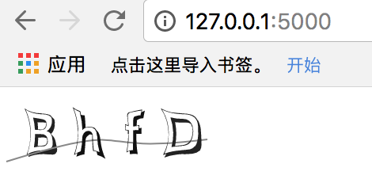
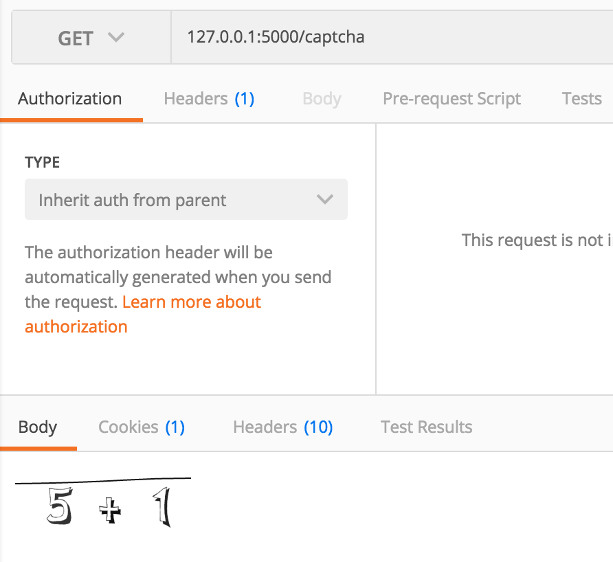
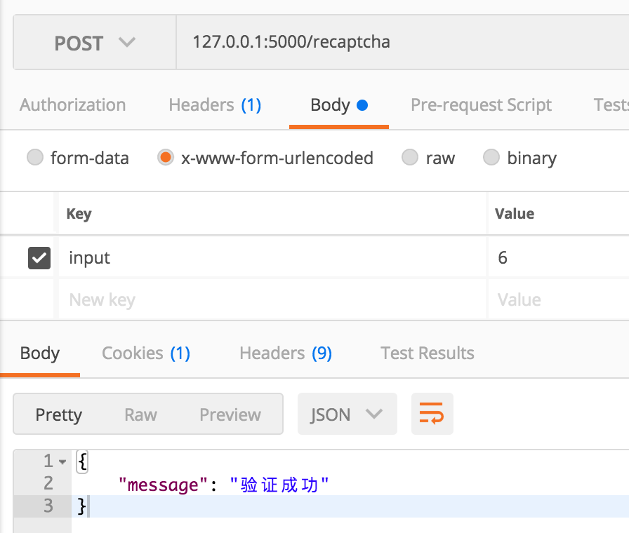

# NodeCaptcha

* 找了好久才找到一个靠谱点的验证码模块——svgCaptcha。
* 话说这个模块还是很给力的，图形算法写的挺好的，图形清晰。

### 实现

* 这里我的想法是直接当成一个接口来处理，然后存在Redis中，给它5分钟的有效期。
* 给一个post接口，然后，将这个提交的值与Redis中的session作对比，如果相同，就next。
* 实现后的效果图

  
  
* 加法效果图

  
  

### 部署到服务器

* 这里我发现了一个问题，部署到服务器，报错了，下面是我修改后的代码。

```javascript
import svgCaptcha from 'svg-captcha'

const picture = async (req, res) => {

    const content = await svgCaptcha.create();
    req.session = content.text;

    res.type('svg');
    return res.status(200).send(content.data);
}

export {
        picture
}
```
