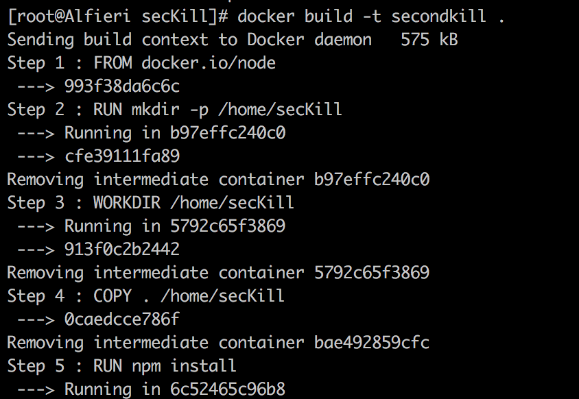
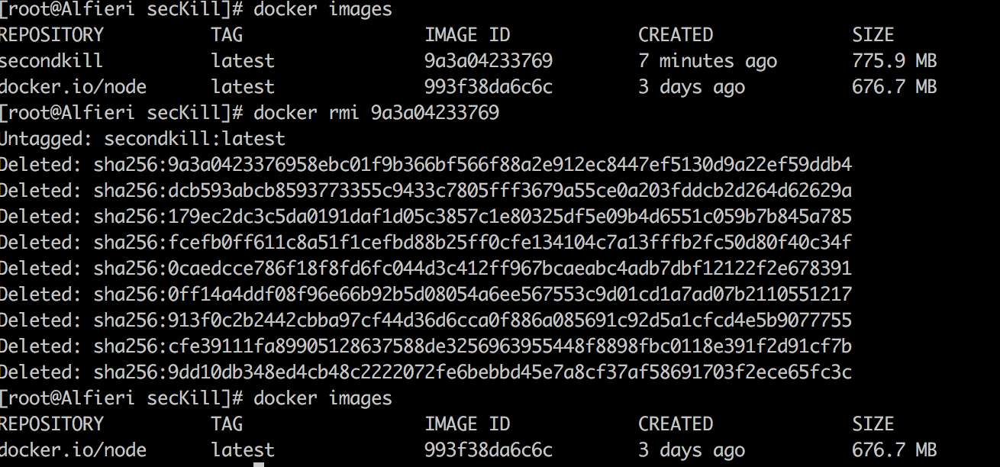
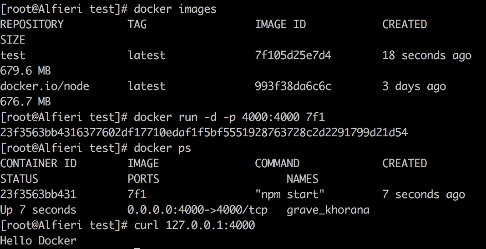

# NodeDockerTest
node.js docker镜像部署

### 前言

* 辞职了，终于有时间来玩玩docker镜像部署了。
* 对技术有追求的人，永远不会趋于满足。

##### 先实现一个hello docker例子再说，然后再来实现mongodb数据库读写。

* build
  1. 将node.js项目拉到docker中去——docker build -t nodeApp .
  
  
* rmi
  1. 删除一个镜像——docker rmi xxx
  
  
* run
  1. 运行镜像——docker rum -d -p xxx
  
