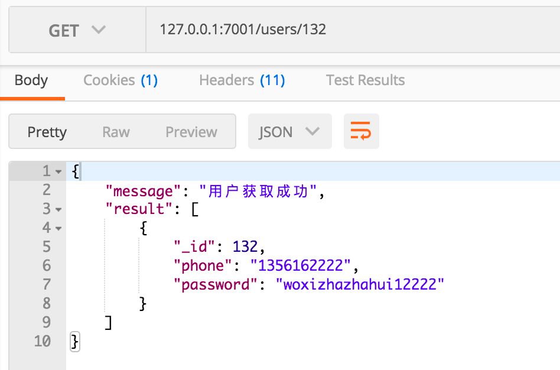

### Development

```bash
$ npm i
$ npm run dev
$ open http://localhost:7001/
```

### Deploy

```bash
$ npm start
$ npm stop
```

### npm scripts

- Use `npm run lint` to check code style.
- Use `npm test` to run unit test.
- Use `npm run autod` to auto detect dependencies upgrade, see [autod](https://www.npmjs.com/package/autod) for more detail.


[egg]: https://eggjs.org

### 前言

- 洋葱框架真的是个骚玩意，二次封装简直不利于开发，只不过开发规范化了。
- 找了好久愣是没有找到洋葱框架优点（难道是自带test模块？？？？）难道用mocha和chai会更难。
- 我从express出来，跳到koa2用了1个小时就玩明白了。这货居然花了我两天。
- 好了不吐槽了。

### 项目描述

- 采用了egg.js+MySQL架构
- 用knex模块解决mysql增删改查操作
- 主要是完成了一个restful api的一个小demo

### 实现后效果

- signup
  

- login
  
  
- get
  
  
- put
  
  
- delete
  
