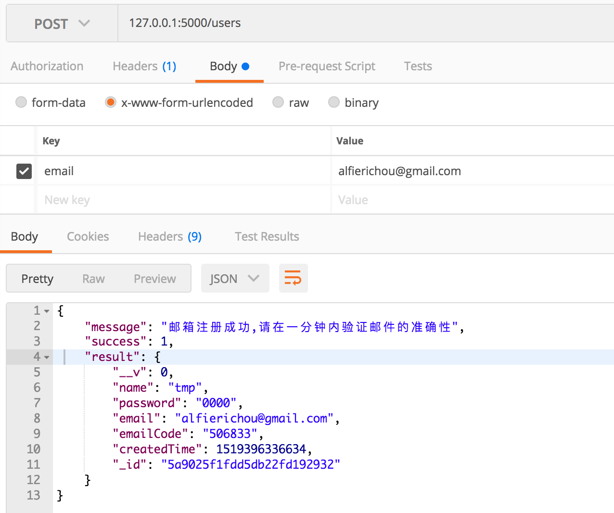
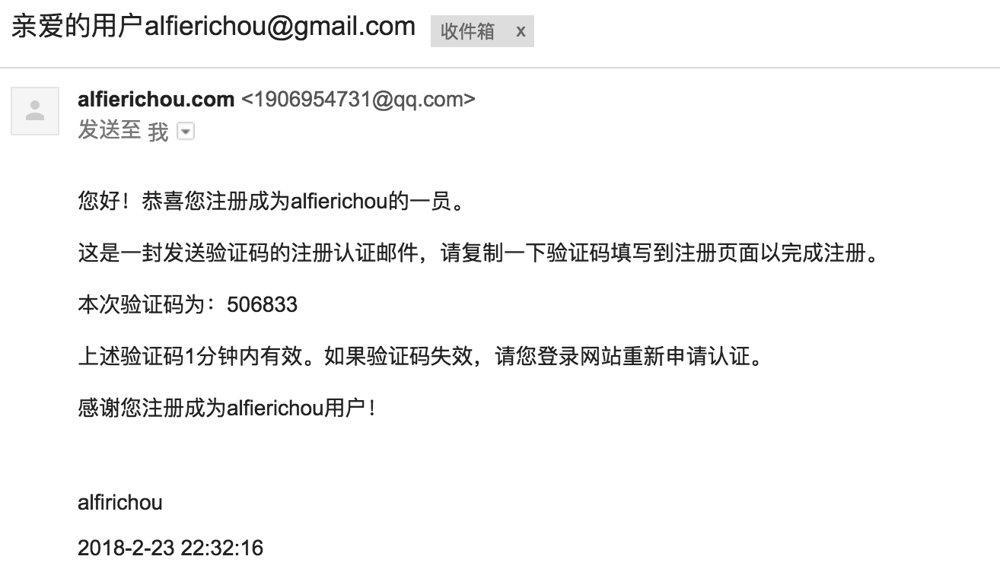

# NodeEmailCaptcha

### 前言

* 本来想写个手机短信验证码的，找免费的Baidu（坑比队友）上都没有，其他的收费平台的最少要200起充，有效期还只有半年，想了想又用不完，干脆就不玩手机短信验证码了，做个邮件的验证码。
* npm上查找node发送email的模块——nodemailer

### 实现过程

1. 用当前的email到数据库中查询
2. 如果数据存在，并且name不为tmp就说明该email已注册
3. 如果数据不存在，则说明该email没有注册
4. 如果数据存在，并且name为tmp就说明该email没有激活，可以重新拉取验证码

### 获取验证码过程

1. 定义一个transporter（host、port、auth、secureConnection）
2. 创建一个randomCode函数（随机生成6位数字）
3. send mail
4. 保存用户
5. setTimeout给个1分钟（时间随便定）的有效期

### 实现后

1. post

2. captcha

### 问题

1. 生成验证码的时间有点长，可能是生成验证码的过程挺慢（写了个操蛋的函数，随机生成一位然后拼接一位（主要是怕首数字为0），容老夫想想怎么解决）
