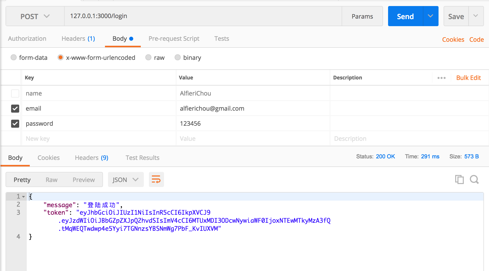

# JWT

好久没写开源项目了，最近都忙于工作，也没有太多时间来写。

### 前言

* 这个项目采用了es6语法规则来实现的一个JWT功能的小demo，也是经过这个多的实践以来，自己搭建的express框架。可能会存在一些问题，但是基本架构是没什么问题的。
* 这个项目是纯后端的，只为前端提供接口。可适用于前后端分离项目。
* 我这个人比较懒，其他的就不多说了，也不想打字（刚把键盘膜给敲出了山丘的感觉）。下面我就全部上图（什么时候有时间再整）。

### 端口测试

1. 注册

2. 登录

3. 没有token提交

4. 因为这里我在post上添加了verifyAuth验证，所以，这里在路由部分先删除这个就不会出现nottoken问题了

5. 获取单本书籍信息

## 真是😓，自己定义的description，截图的时候，偏偏要写成descript。这个脑子哟~~~~
