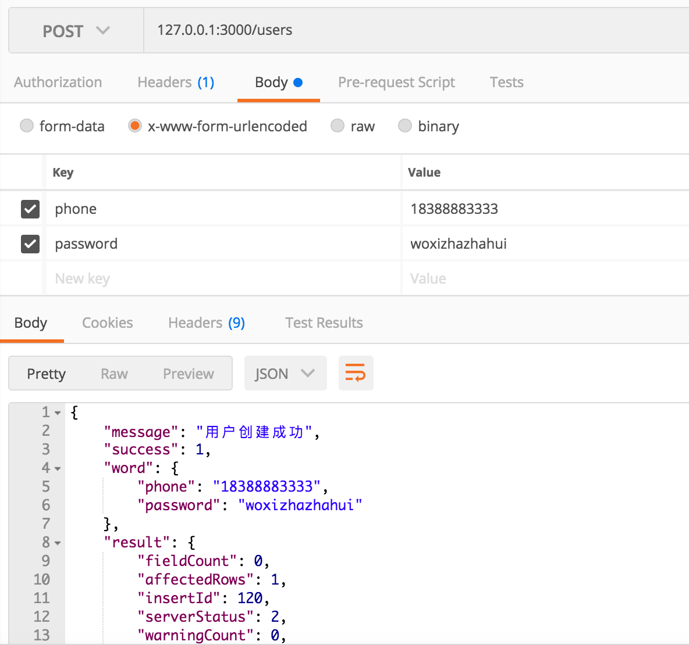
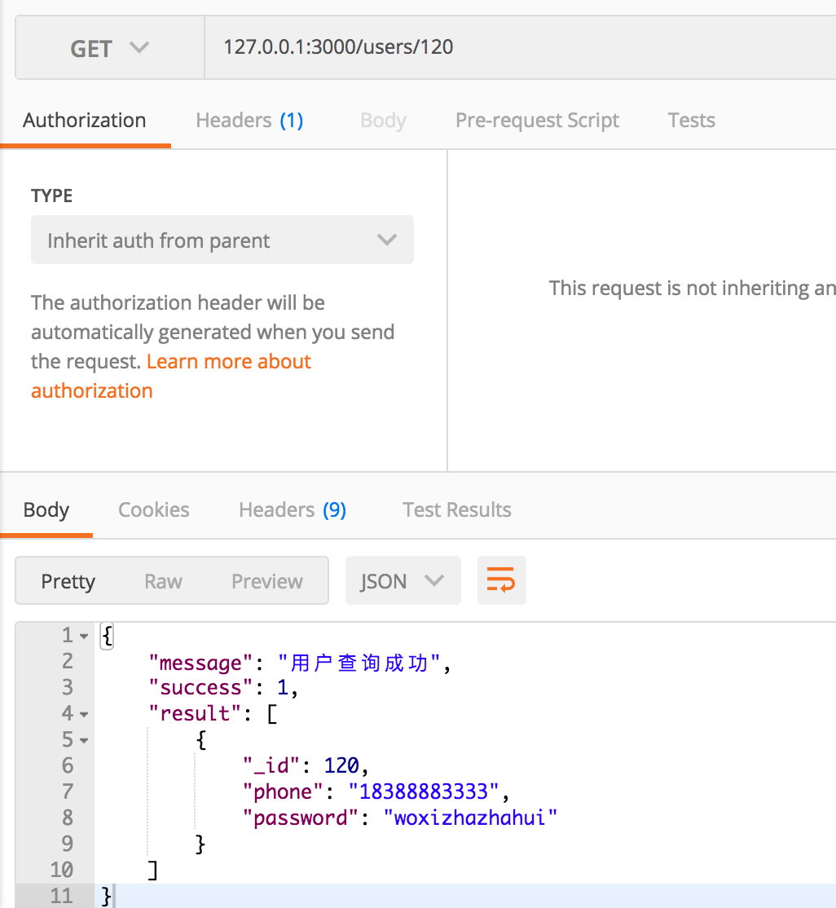
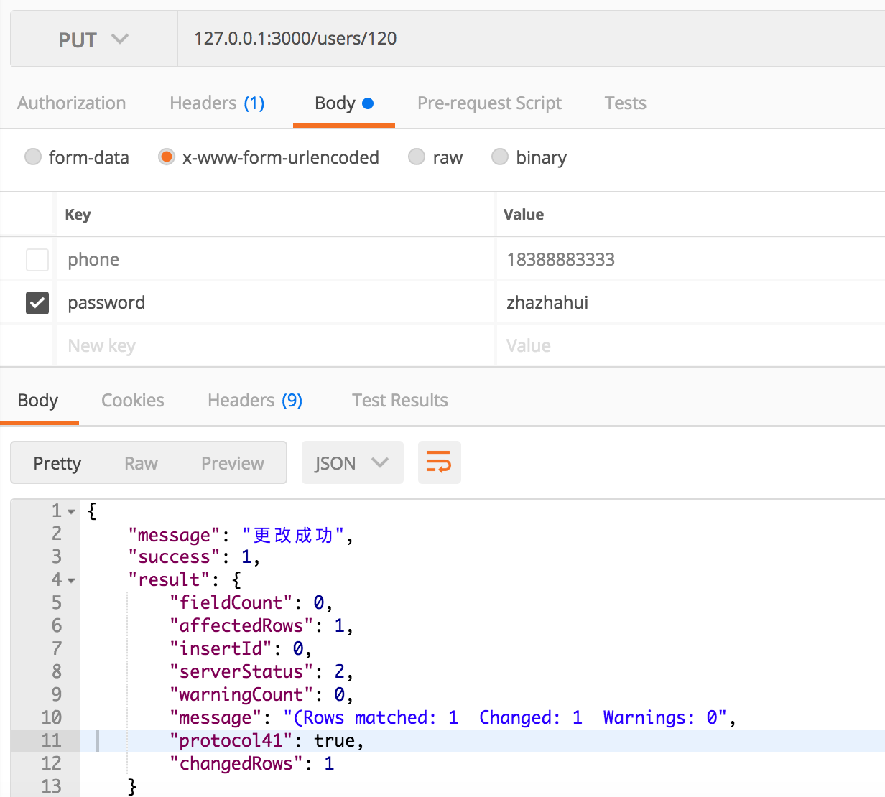

# NodeMysqlRestful

node.js mysql实现restful API设计

### 前言

* 一直都想写个MySQL的node.js应用，可是一直没有时间，所以，趁着春节假期还有最后一天，手痒一波。
* 没别的想说的，还是觉得MongoDB才是真爱，这个连接池的问题真的难整。我就想简简单单的用个async/await居然这么难（还是太菜😭😭😭）。
* 发现一个很好玩的库promise-mysql，什么时候可以将原生的pool整成Promise的链式调用。

### 实现后截图

1. 创建用户
  
  
2. 获取单个用户
  
  
3. 修改单个用户的个人信息
  
  
### 后记

* 一个技术栈，从不会用到熟练掌握的周期太长，只需要专注一个精一个，其他略懂知道用就行。

-
### 更新

1. promise-mysql的连接池
2. 采用了bluebird库实现了Using/Disposer方式连接
3. 封装了query方法

* 一个疑问🤔？

#### 最近怕是async/await用多了，产生了一种惰性，什么都能异步解决。
