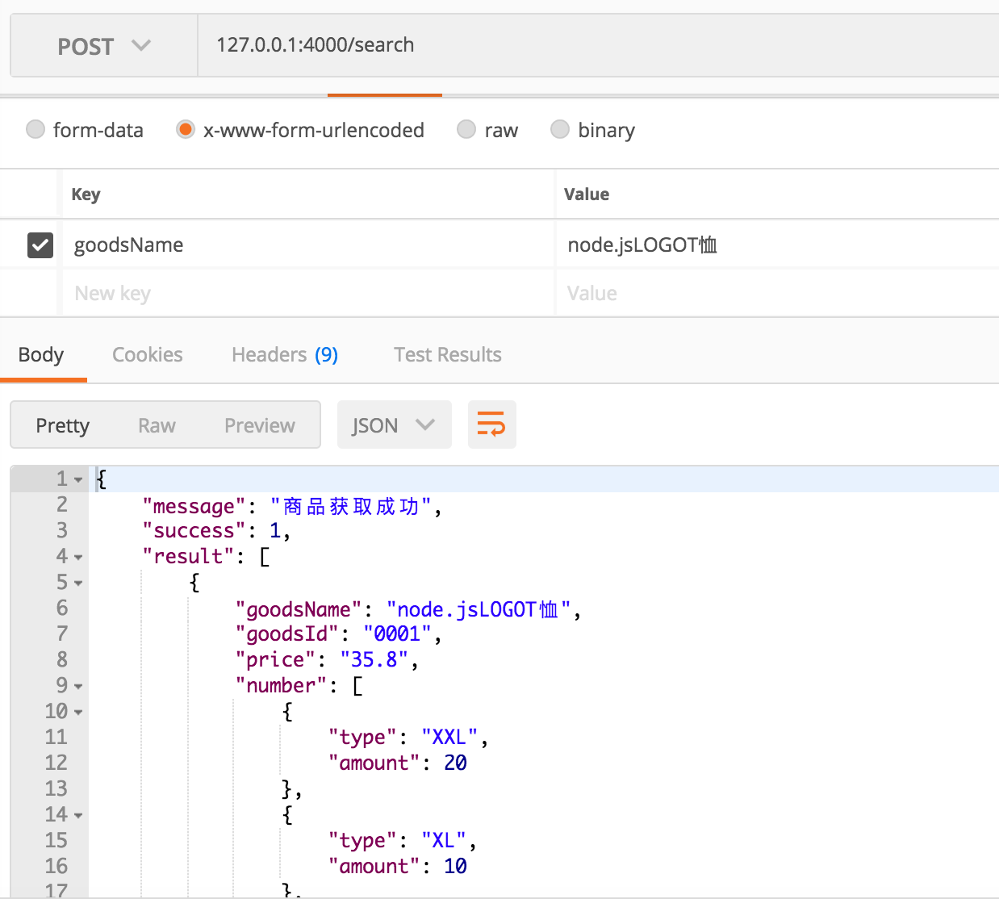
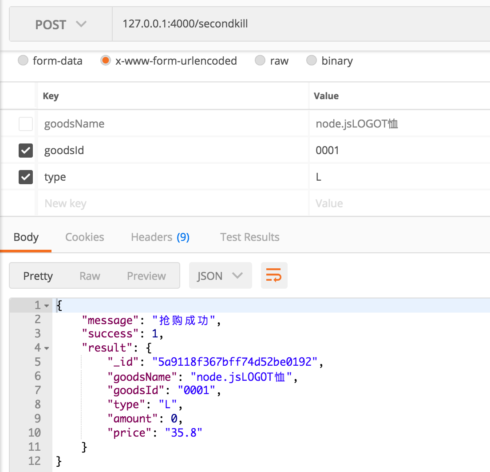
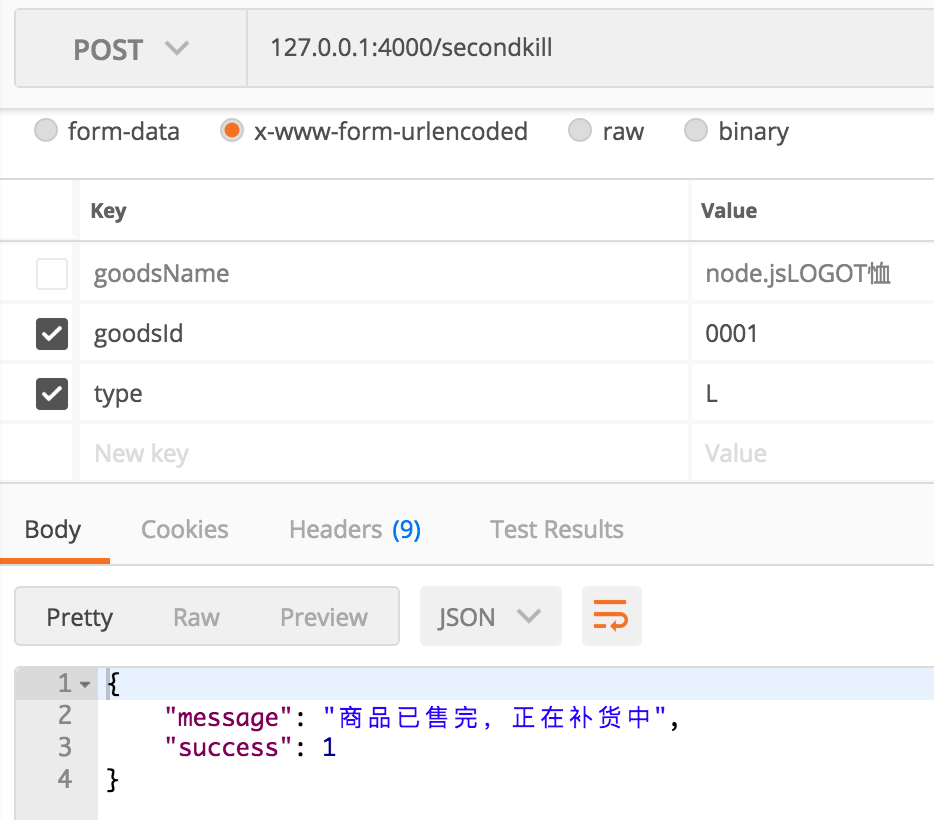

# NodeSecondKill
SecondKill on node.js.

### 前言

* jwt验证，Redis还有用户登录那些东西我就不写了（懒癌患者）
* 后期接入支付宝和微信支付，现在不管那么多了，先实现效果
* 最近有了个新想法（宁愿存储在数据库中的数据简单或者复杂，我都不应该将数据库设计的数据结构暴露出来，尽量自己去拼接返回数据（为了数据库安全）。）

### 实现后

* 我设为L只有1件

1. search

2. secondKill

3. nogoods

### 更新

* 添加webpack打包文件，没有采用最新的webpack4.0.0
