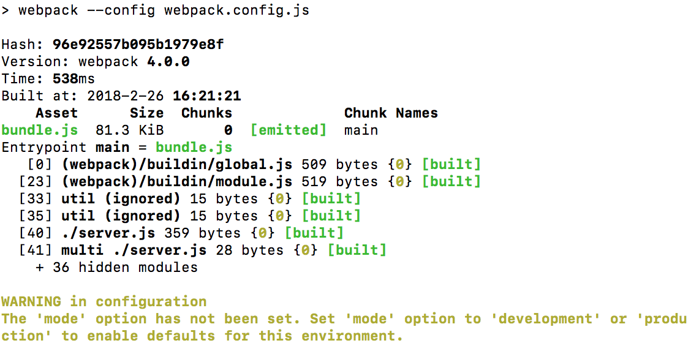
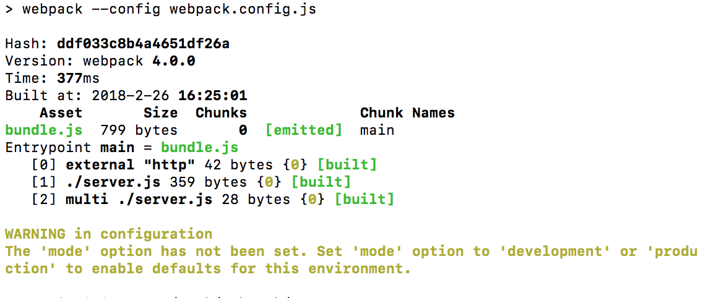
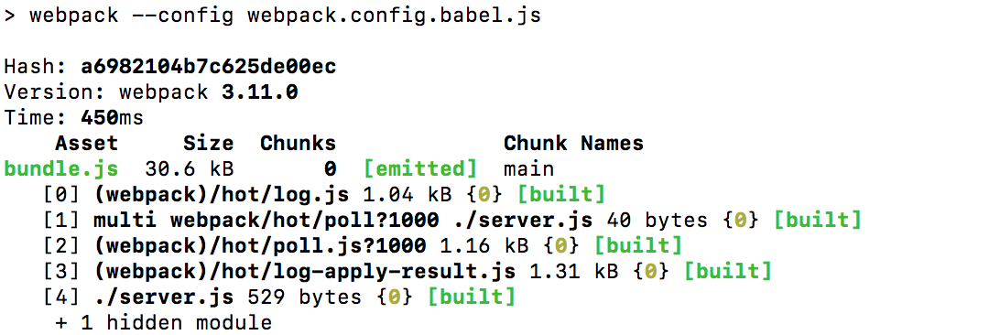

# NodeWebpack

### 前言

* webpack升级到了4.0.0版本，发现这个东西不更新还好，一更新头都大了，本来没什么问题的，直接项目报错。所以，我在es6编译的时候还是将webpack的版本回退到了3.11.0。才解决了这个问题。

* 坐等大神们出webpack4.0.0的es6编译配置。

### 实现后的效果

1. test

2. es5webpack

3. es6webpack

### 参考文献

https://github.com/gomeplusFED/blog/blob/master/2016-04/use%20webpack%20in%20your%20node%20app.md
